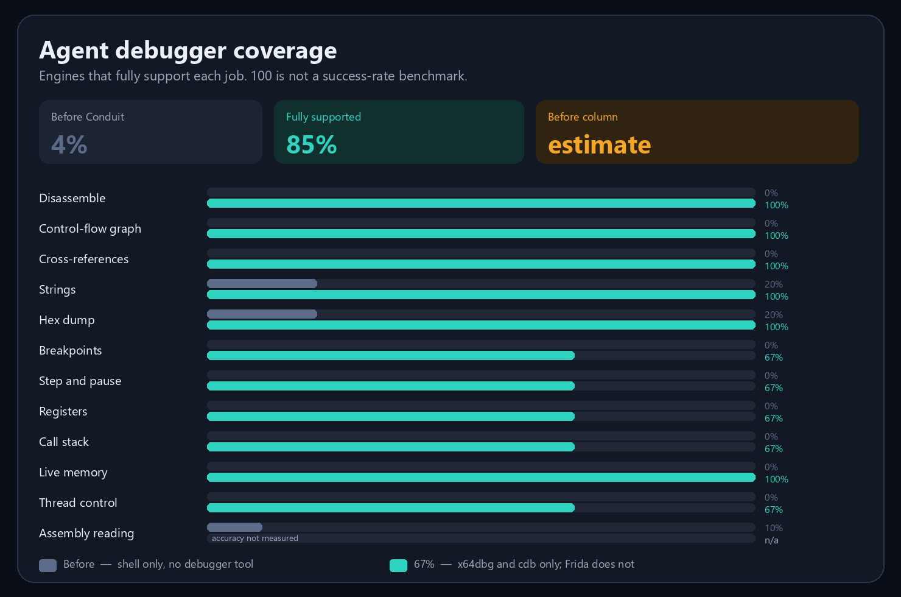

# Conduit

<p align="center">
  <a href="LICENSE"></a>
  <a href="package.json"></a>
  <a href="https://modelcontextprotocol.io"></a>
  
</p>

**Conduit** is an [MCP](https://modelcontextprotocol.io) debugger. One server connects Cursor, Claude, Cline, and any other MCP client to **radare2**, **x64dbg**, **cdb**, and **Frida** for disassembly, control-flow graphs, cross-references, strings, and live debugging.

<p align="center">
  
</p>

The bars score 12 debugger jobs. **Before** means a coding agent with a shell and no debugger tool: it can scrape strings or a hex dump, and it can narrate assembly only if someone pastes it. **With Conduit** means the same job returns from an MCP tool (`disassemble`, `get_cfg`, `xrefs`, `debug_*`, `explain`). Average coverage moves from **4%** to **100%** (**+96 points**). That is tool coverage, not a model-IQ benchmark. Strings, hex dump, and assembly reading stay above zero before Conduit because a shell or a pasted listing can still produce a partial answer.

Static analysis and live debugging share one tool surface. `session_open` picks the engine. Nothing is stubbed: a tool the engine does not implement returns `capability_unsupported`.

| | |
|---|---|
| Protocol | MCP `2026-07-28`, plus 2025-era clients |
| Transports | stdio, Streamable HTTP (`POST /mcp`, `GET /health`) |
| Static engine | radare2 — disassembly, CFG, xrefs, strings, hexdump |
| Debug engines | x64dbg, cdb (WinDbg), Frida |
| Clients | Cursor, Claude Desktop, Cline, OpenCode |

## Install

Node.js 20 or newer must already be on PATH. Then:

```sh
pip install conduit-debugger
```

That puts the `conduit` command on PATH. The first launch installs the Node dependencies into your home directory. `conduit`, `conduit-mcp`, and `conduit-cli` are already taken on PyPI, so the package name is `conduit-debugger`.

From a checkout, the same package installs with `pip install .`

## Prerequisites

Clean-machine install, in order:

1. **Node.js ≥ 20** — `node --version`
2. **radare2** — a prebuilt release, no compilation. Any 6.x works
   (goldens were captured with 6.2.2; the comparator tolerates formatting
   drift between r2 versions). Must be on PATH as `radare2` or `r2`:
   `r2 -v`. Override the path with `DBG_BRIDGE_R2`.
3. **Graphviz** — `dot` on PATH: `dot -V`.
4. **Python 3** — only to regenerate or verify the example fixture:
   `python --version`.

`prerequisites` reports these programs plus x64dbg, cdb, Frida, and ScyllaHide.
A missing program includes `indir` (a URL) and `nereye` (where to put it). Conduit
does not download it. The same hint is appended to `engine_unavailable`
when a session tries to start a missing engine.

`explain` reads an assembly window: what the region does, where it jumps, and
which calls are notifications (`MessageBox`, `printf`, and the like). Pass
instructions already read, or a `session_id`. Reading a live debug session
still needs `confirm:true`.

## Run

```sh
node dist/server.js                                     # stdio (default)
node dist/server.js --transport http --port 3847        # Streamable HTTP
```

HTTP prints `conduit streamable-http 2026-07-28 http://127.0.0.1:3847/mcp`
and serves `POST /mcp` plus `GET /health`. `--host`, `--port`, and
`--transport` flags exist; `DBG_BRIDGE_HOST`, `DBG_BRIDGE_PORT`, and
`DBG_BRIDGE_TRANSPORT` do the same.

Optional token: set `DBG_BRIDGE_TOKEN` and every HTTP route (including
`/health`) requires `Authorization: Bearer <token>` (anything else gets
`401 {error:"unauthorized"}`). When unset, localhost stays open. The token
is env-only (a flag would leak via the process list) and is compared in
constant time. stdio needs no token: spawning the process locally is the
authentication there.

## Connect a client

Ready-made configs live in `configs/` (stdio and HTTP variants for Cursor,
Claude Desktop, Cline, and OpenCode). Replace `<DBG_BRIDGE_DIR>` with the
absolute path of this folder and follow `configs/README.md`, then restart
the client.

Quick check inside the client: call `health`. Expect `status: ok` and
`name: conduit`.

Client compatibility: the server speaks `2026-07-28` and also accepts
2025-era clients (for example opencode 1.x negotiating `2025-11-25`)
through the SDK's legacy fallback. Verified end-to-end with real
`opencode` and `cursor-agent` runs (`health` → `session_open` →
`open_target` → `disassemble`).

## End-to-end check

Fixture: `examples/target/mini_branch.elf` — a hand-packed 64-bit ELF
(1536 bytes, no compiler needed) whose entry `0x400200` runs a branching
function (`lea` + `cmp`/`je` if/else). `.rodata` holds `HELLO-FIXTURE`
and `mini-branch`. Sources: `mini_branch.c`, `mini_branch.asm`,
`gen_mini_branch.py`.

1. `session_open {"engine": "radare2"}` → `session_id`
2. `open_target {"session_id", "path": "<abs path>/mini_branch.elf", "mode": "static"}`
3. `disassemble {"session_id"}` → 10 ops at `entry0`
4. `get_cfg {"session_id", "format": "both"}` → 4-block CFG, JSON + DOT
5. `strings {"session_id"}` → `HELLO-FIXTURE` @ `0x400300`, `mini-branch` @ `0x40030e`
6. `dump {"session_id", "address": "0x400200", "length": 34, "format": "json"}`
7. `xrefs {"session_id", "address": "0x400300"}` → DATA xref from `0x400200`
8. `events_pull {"session_id"}` → contains `target.opened`
9. `close_target {"session_id"}` / `session_close {"session_id"}`

Raw-protocol note (only if you drive the server without an MCP client):
every request on protocol `2026-07-28` carries the envelope
`_meta: {"io.modelcontextprotocol/protocolVersion": "2026-07-28", "io.modelcontextprotocol/clientCapabilities": {}}`,
starting with `server/discover`. Over HTTP, `POST /mcp` also requires the
`Mcp-Method` header (and `Mcp-Name` for `tools/call`). The golden runner
(`tests/run_golden.mjs`) shows the exact wire format. The stdio transport
pins its dialect on the first request, so a bare request or a legacy
`initialize` locks that process into legacy mode and later
`server/discover` calls fail with `Method not found`.

## Debug engines

The same `debug_*` tool names work on every engine. Config files under
`configs/` do not name an engine. `session_open` does.

| | x64dbg | cdb | frida |
|---|---|---|---|
| Launch | hidden debugger, break on entry | hidden `cdb.exe`, stops at the loader breakpoint and plants an entry breakpoint | spawn stays suspended until `continue` |
| Attach / close | detach leaves the target running | `qd` on attach, `q` on launch | `detach` on attach, `kill` on launch. Pid attach is impossible for an embedded Gadget or a phone package: `debug_attach` takes `gadget` (`host:port`) or `usb` + `package` |
| Software breakpoint | yes | yes | `capability_unsupported` |
| Hardware execute | yes | yes (after the initial breakpoint) | yes, slots 0–3; a fifth is `no_breakpoint_slot` |
| Hardware read/write, memory breakpoints | yes | hardware read/write yes; memory no | `capability_unsupported` |
| Continue | until the next stop or exit | until the next stop or exit | until the next hit or exit; the hit slot is disarmed |
| Pause / step | yes | yes | `capability_unsupported` |
| Registers / call stack | live | live | last hardware-breakpoint hit only |
| Live memory read / search / dump | `debug_memory` with `confirm:true` | same | same |
| Disassemble / run to address | `debug_code` with `confirm:true` | same | same; run-to arms one hardware slot and disarms it on the hit |
| Assemble | XEDParse, no GUI | `capability_unsupported` | `capability_unsupported` |
| Thread list / context | `debug_thread` with `confirm:true` | same; id is the cdb index | same; id is the OS thread id |
| Thread select / freeze | yes | yes | `capability_unsupported` |
| Scylla / ScyllaHide | `debug_plugin` reports files and does not open a window | `capability_unsupported` | `capability_unsupported` |
| Snapshot / rewind | checkpoint of registers, threads, and one memory window | same | memory window restores; register commit is `capability_unsupported` when Frida cannot write thread context |
| Where | `X64DBG_DIR` or `%USERPROFILE%\Tools\x64dbg` | `CDB_DIR` or Windows Kits Debugging Tools | npm dependency `frida` |

Debug fixtures live at `plugin/x64dbg/test/mini_pe_x64.exe` and `mini_pe_x86.exe`.

## Test

```sh
npm test                  # node tests/run_golden.mjs
npm run test:debug        # x64dbg launch + attach (Windows)
npm run test:cdb          # cdb launch + attach (Windows)
npm run test:frida        # Frida hardware-breakpoint loop (Windows)
npm run test:dynamic      # confirm gate, live memory/code/thread/checkpoint
npm run test:explain      # assembly reading + download hints
npm run test:concurrency  # multi-client isolation over HTTP
npm run test:auth         # optional DBG_BRIDGE_TOKEN gate over HTTP
```

Expected: `38 passed, 0 failed`. The suite checks prerequisites, fixture
determinism, golden output, Graphviz rendering, and full MCP sessions over
stdio and HTTP.

To re-capture goldens after an intentional behavior change:

```sh
node tests/run_golden.mjs --update
```

## Troubleshooting

| Symptom | Cause / fix |
|---|---|
| `engine_unavailable` | `r2` is not on PATH. Install a prebuilt radare2 release or set `DBG_BRIDGE_R2` |
| `npm test` fails at prereqs | run `npm run build` first; install the missing tool from Prerequisites |
| golden mismatch after an r2 upgrade | formatting drift: run `--update`, inspect the diff, commit if only prose changed |
| HTTP client cannot connect | the server must be running (`--transport http`); the URL port must match `--port` |
| `capability_unsupported` on `open_target` | only `mode: "static"` is supported on radare2 |
| `capability_unsupported` on disassemble / get_cfg | the session is not radare2 |
| `capability_unsupported` on `debug_step` / `debug_pause` | Frida has no single-step or thread-suspend API |
| `confirmation_required` | repeat the dynamic tool call with `confirm:true` |
| `no_breakpoint_slot` | Frida already holds four hardware execute breakpoints |
| `engine_unavailable` on `debug_open` with `cdb` | set `CDB_DIR` to the Debugging Tools `Debuggers` directory |
| `Method not found` on `server/discover` (stdio) | the dialect was pinned by the first request; restart and send the `_meta` envelope from request 1 |
| `401 {error:"unauthorized"}` | `DBG_BRIDGE_TOKEN` is set: send `Authorization: Bearer <token>` |
| Host rejected over HTTP | set `DBG_BRIDGE_EXTRA_HOSTS` to the public hostname(s), comma-separated |

## Layout

```text
conduit/
├── src/                 engines and MCP tools
├── dist/                build output (git-ignored)
├── examples/target/     mini_branch.elf fixture
├── plugin/x64dbg/       x64dbg bridge and debug fixtures
├── tests/               golden runner and engine acceptance
├── configs/             Cursor, Claude Desktop, Cline, OpenCode
└── README.md
```

## License

MIT. See [LICENSE](LICENSE). The x64dbg plugin sources are vendored from
[ouonet/x64dbg-mcp](https://github.com/ouonet/x64dbg-mcp); see
`plugin/x64dbg/THIRD_PARTY_NOTICES.md`.
